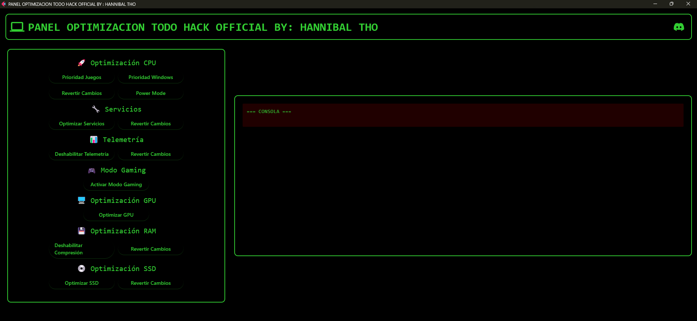

# 🚀 THO-OPTIMIZE - PANEL DE OPTIMIZACION PARA WINDOWS

<div align="center">



[](https://discord.gg/4svwzsy3UP)
[](https://youtu.be/2-KIFU9jc1E?si=RUpPK4iljoV-McVH)

</div>

## 📋 Características

- ⚡ Optimización de CPU con prioridades personalizadas
- 🎮 Modo Gaming para mejor rendimiento
- 🔧 Gestión de servicios de Windows
- 📊 Control de telemetría
- 🖥️ Optimización de GPU
- 💾 Gestión de memoria RAM
- 💿 Optimización para unidades SSD
- 📡 Mejoras de red y DNS
- 🗑️ Limpieza de archivos temporales

## 🛠️ Requisitos

```bash
Python 3.8 o superior
pip install -r requirements.txt
```

## 📥 Instalación

1. Clona el repositorio:
```bash
git clone https://github.com/tu_usuario/THO-OPTIMIZE.git
```

2. Instala las dependencias:
```bash
cd THO-OPTIMIZE
pip install -r requirements.txt
```

3. Ejecuta la aplicación:
```bash
python.exe py.py
```

## ⚙️ Uso

1. Ejecuta la aplicación como administrador
2. Selecciona las optimizaciones que desees aplicar
3. Monitorea los cambios en la consola integrada
4. Revierte los cambios si es necesario usando los botones correspondientes

## 🎯 Características Principales

- Interfaz gráfica intuitiva
- Consola de seguimiento en tiempo real
- Opciones para revertir cambios
- Optimizaciones específicas para gaming
- Sistema de limpieza automática

## ⚠️ Advertencias

- Ejecutar siempre como administrador
- Crear un punto de restauración antes de usar
- Algunas optimizaciones pueden requerir reinicio
- Usar bajo tu propia responsabilidad

## 🤝 Soporte

[](https://discord.gg/4svwzsy3UP)

## 📄 Licencia

Este proyecto está bajo la Licencia MIT. Ver el archivo `LICENSE` para más detalles.
